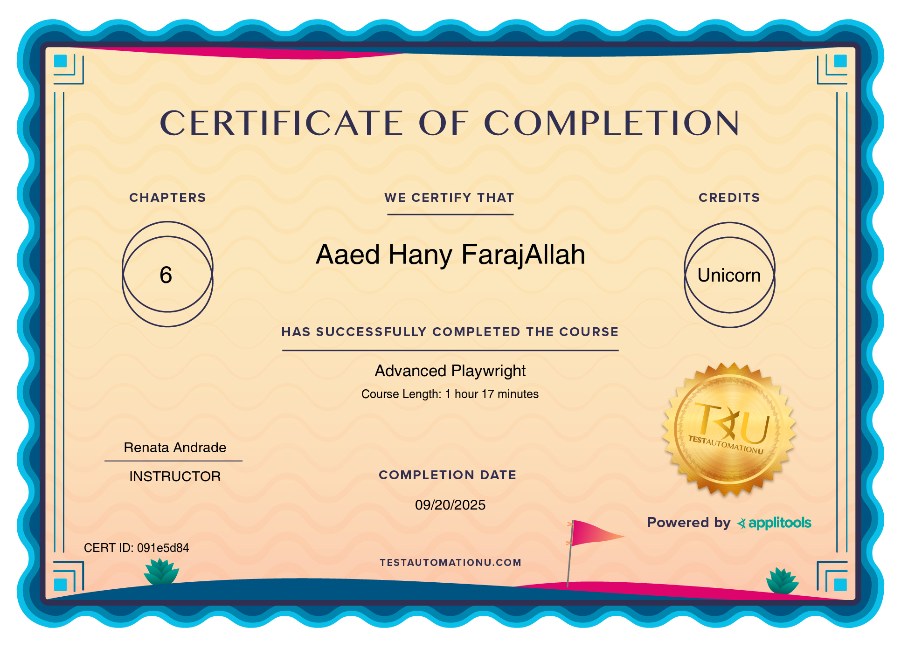
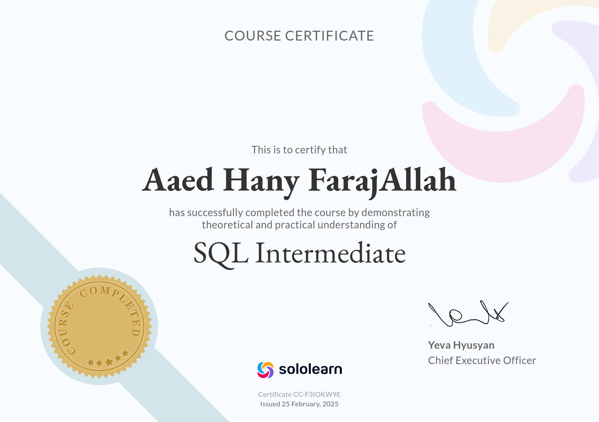
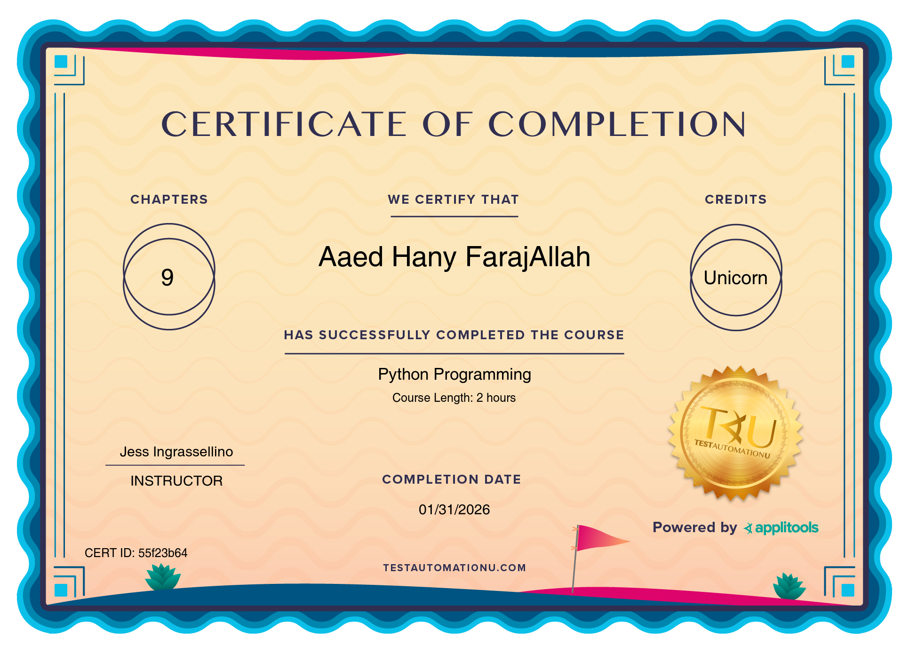

<h1 align="left">Hey 👋 What's up?</h1>

###

My name is Aaed and I'm a QA engineer & Web scrapper.

###

Hello World!!  "Turning Code into Scalable Solutions"

###

<h2 align="left">About me</h2>

###

✨ Creating bugs since 2019 📚 I'm currently learning POSTMAN  🎯 Goals: to be the best at scraping

###

  
  

###
<h2 align="left">🎓 My Certificates</h2>

<!-- First row -->

  

  

  

<!-- Second row -->

  

  

  

###

###

<h2 align="left">Contact me ;</h2>

###

  
  
  
  

###
